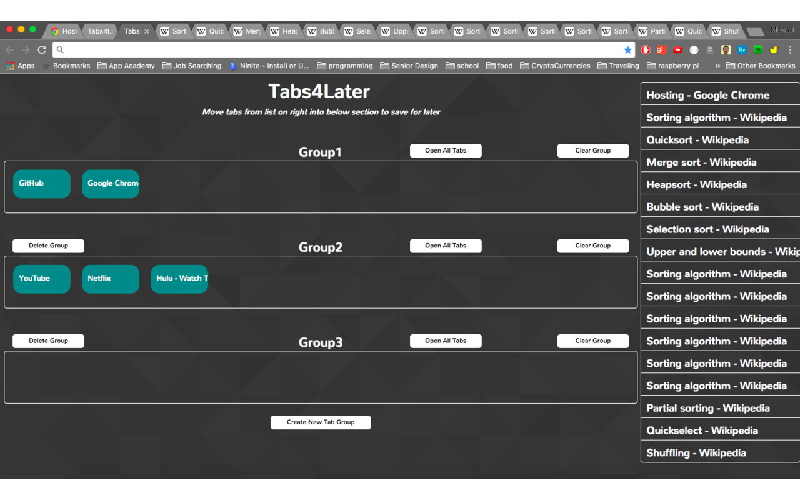
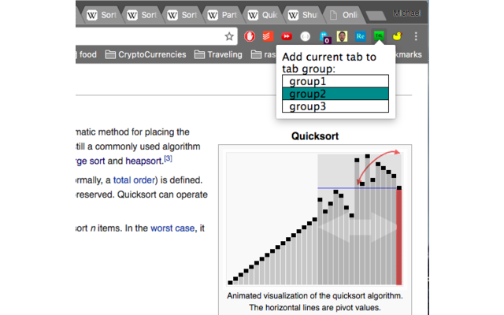

## Tabs4Later

[Chrome Store Link](https://chrome.google.com/webstore/detail/tabs4later/eelcoijecgaglhnokiodhkkiamfhfkla) - Free

### Background

Tab management is a hassle. Tabs4Later can help reduce the number of running processes on the machine resulting in a cleaner and faster browser experience that is easy to use. Users can save open tabs into custom groups that can be re-opened at a later time.

### Screenshots

### Features
- Drag currently open tabs (listed on right side of new tab page) into a group.  This will close the tab in the chrome window and save it within the destination group.
- Clicking a tab in a group section will cause the selected tab to open in a new window
- Clicking the 'Open All Tabs' button will open all the tabs in a selected group
- Clicking 'Clear Group' button will remove all the saved tabs from a selected group
- Clicking 'Delete Group' button will delete the group and all of its tabs
- Users can click the T4L icon on a webpage to save the current page into a selected group without closing the active tab
- Users can create new groups to save tabs
- Users can close individual tabs by clicking the 'x' on each currently open tab in the list displayed on the right side of the new tab page
- Users can remove individual tabs from a group by clicking the 'x' on each saved tab

### Technologies
- HTML5: Used to build new tab and popup pages.  Draggable feature was incorporated into the new tab page
- jQuery: Used to create event handlers that update the new tab page based on user events
- CSS: Used for styling both the new tab and the popup page
