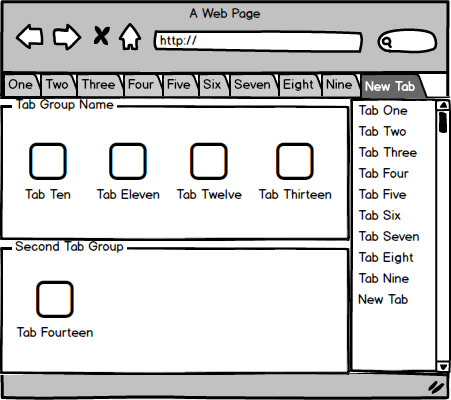

## Tabs4Later

### Background

Tab management is a hassle.  Many users have 10+ tabs open at once due to researching/viewing multiple topics.  Tabs4Later reduces the number of running processes on the machine resulting in a cleaner, easier to use browser experience that is easy to use and easier on the computer. Users can save open tabs to be opened at a later time.  Temporarily closing tabs results in a faster web browsing experience.

### Functionality & MVP
- [ ] Users can create tab groups
- [ ] Moving a currently open tab into a tab group will close the tab and save it to a group
- [ ] Tabs can be re-opened at a later time
- [ ] Tabs4Later will replace the default new tab page
- [ ] Clicking new tab will open Tabs4Later and have the url be the default/selected input - just like how new tab is by default.  that way users can use it without much adjusting

### Wireframes

### Technologies & Technical Challenges

This Chrome extension will be built using JavaScript, HTML, and CSS.  The following files will be implemented:

- `manifest.json`: contains the metadata for the chrome extension
- `package.json`: contains JavaScript dependencies
- `popup.html`: renders the popup menu
- `popup.css`: styles the popup menu
- `background.html`: renders the new tab page and will be the core of the extension
- `newTab.css`: styles the new tab page
- `content.js`: handles the logic of saving, closing,and opening tabs

The main technical challenges will be:

- opening and closing tabs from the new tab page
- saving tabs into groups that persists between browser sessions
- creating a smooth user interface with clean styling

### Implementation Timeline

**Day 1**: Build the basic file structure for the extension.  Tasks to complete by the end of day:

- Completed `package.json`
- Completed `manifest.json`

**Day 2**: Create initial layout for new tab page.  Tasks to complete by the end of day:

- Ability to render basic layout of new tab page
- Display currently open tabs in a list

**Day 3**: Create tab groups that will persist from session to session.  Task to complete by the end of day:

- Build tab groups that save to Chrome storage

**Day 4**: Work on moving currently open tabs into created tab groups.  Tasks to complete by the end of day:

- Ability to save open tabs into groups
- Ability to open tabs that are saved in tab groups

**Day 5**: Style the new tab page.  Tasks to complete by the end of day:

- Create simple and clean list of tabs for currently open and grouped tabs
- Add hover and dragging effects to tabs

**Day 6**: Create simple popup window.  Tasks to complete by the end of day:

- Complete popup window
- Ability to add current tab to existing group
- Ability to create new group and add current tab

Bonus Features:

- [ ] Auto close tabs if left open and unviewed for a certain duration.  Auto closed tabs would be automatically placed into a group. Tagged or tabs listed in a certain group would be exempt from auto close
- [ ] Tagging tabs and creating search to filter tabs
